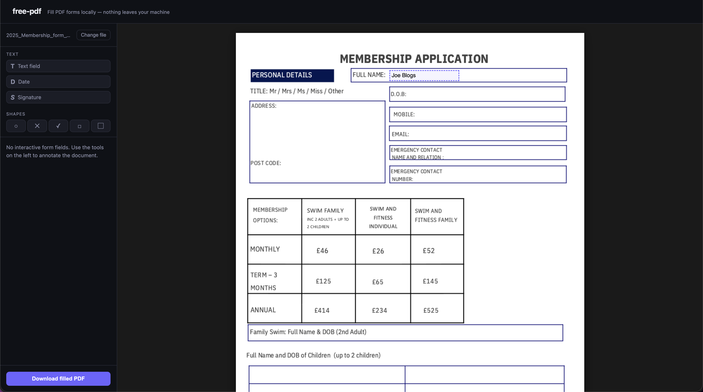

# free-pdf

A lightweight, local PDF form filler and annotator. Upload a PDF, fill in form fields or add text/shape/signature overlays, and download the result — all processed locally on your machine.



## Features

- Fill native PDF form fields (text, checkboxes)
- Add text overlays with font, size, bold/italic, and colour controls
- Draw shapes (rectangle, rounded rect, circle, checkmark, cross)
- Capture and embed signatures
- Insert date fields with a date picker
- Snap-to-align guides when positioning overlays
- Session persistence — your work survives a page reload

## Requirements

- Node.js 18 or later
- npm

## Getting started

```bash
git clone https://github.com/JohnBrown0126/free-pdf.git
cd free-pdf
npm install
npm start
```

Open [http://localhost:3000](http://localhost:3000) in your browser.

For auto-reload during development:

```bash
npm run dev
```

## Running tests

```bash
npm test              # unit tests
npm run test:e2e      # end-to-end tests (Playwright)
```

See [CONTRIBUTING.md](CONTRIBUTING.md) for more detail.

## Browser support

Tested in current Chrome, Edge, and Firefox. Requires ES module support.

## License

[MIT](LICENSE)
