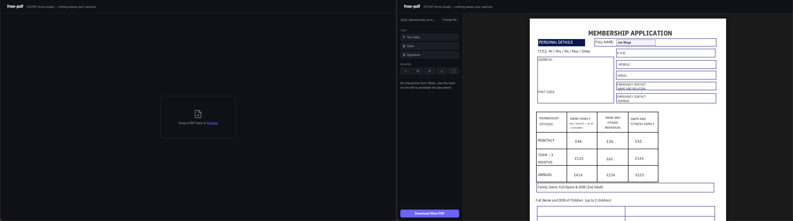

# free-pdf

**Fill PDF forms and annotate PDFs locally — nothing leaves your machine.**

A self-hosted, browser-based PDF form filler and annotator. Upload a PDF, fill native form fields or add text, shapes, and signatures as overlays, then download the result as a flattened PDF. Runs entirely on localhost via Node.js — no accounts, no cloud, no uploads to third-party servers.



## Features

- Fill native AcroForm fields (text inputs, checkboxes)
- Add text overlays with font, size, bold/italic, and colour controls
- Draw shape overlays: rectangle, rounded rect, circle, checkmark, cross
- Capture and embed signatures
- Insert date fields with a date picker
- Snap-to-align guides when positioning overlays
- Session persistence — your work survives a page reload
- Runs fully offline after install

## Why this exists

Most free PDF tools require uploading your file to a third-party server (PDF24, Smallpdf, ilovepdf). Desktop alternatives are either limited (macOS Preview has no freeform overlays or shapes) or paywalled (Adobe Acrobat).

free-pdf runs entirely on `localhost`. Your PDF never leaves your machine. It handles both native AcroForm fields and freeform annotation, and produces a properly flattened PDF — overlays are baked into the file, not just a display layer.

## Requirements

- Node.js 24 or later
- npm

## Getting started

```bash
git clone https://github.com/JohnBrown0126/free-pdf.git
cd free-pdf
npm install
npm start
```

Open [http://localhost:3000](http://localhost:3000) in your browser.

For auto-reload during development:

```bash
npm run dev
```

## Running tests

```bash
npm test              # unit tests
npm run test:e2e      # end-to-end tests (Playwright)
```

See [CONTRIBUTING.md](CONTRIBUTING.md) for more detail.

## Browser support

Tested in current Chrome, Edge, and Firefox. Requires ES module support.

## License

[MIT](LICENSE)
